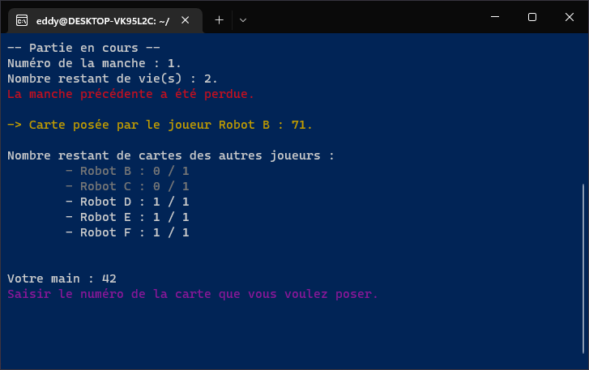

<div id="top"></div>

<!-- PROJECT LOGO -->
<br />
<div align="center">
  <h3 align="center">The Mind</h3>
  <p align="center">
    <a href="#">View Demo (TODO)</a>
  </p>
</div>

<!-- TABLE OF CONTENTS -->
<details>
  <summary>Table of Contents</summary>
  <ol>
    <li><a href="#about-the-project">About The Project</a></li>
    <li><a href="#context">Context</a></li>
    <li><a href="#built-with">Built With</a></li>
    <li><a href="#documentation">Documentation</a></li>
    <li><a href="#getting-started">Getting Started</a></li>
    <li><a href="#usage">Usage</a></li>
    <li><a href="#contributors">Contributors</a></li>
    <li><a href="#acknowledgments">Acknowledgments</a></li>
  </ol>
</details>

<!-- ABOUT THE PROJECT -->
## About The Project

<div align="center">
  
</div>
<br />

This project basic principle is: a simple version of the existing card game **[The Mind](https://boardgamegeek.com/boardgame/244992/mind)** playable in multiplayer (in LAN or Internet) and with bots.

To give a brief idea of the game, it is a game in several rounds. In the first round, each player receives a card with a number between 1 and 100. Each player must play the cards in ascending order, from the smallest to the largest, otherwise the round is lost, so the game is cooperative. Be careful, no player is allowed to communicate either verbally or physically, hence the difficulty.

We have slightly modified the original game, to add three lives, when a round is lost, a life is lost. There is no limit to the number of rounds.

### Features

- [x] Playable with up to 20 players and bots.
- [x] Stats generation in a PDF file at game end.

<p align="right">(<a href="#top">back to top</a>)</p>

<!-- CONTEXT -->
## Context

This project is an academic project made during the **third year** of a **Bachelor** of Computer Science.  
The development was done by 2 people.

<p align="right">(<a href="#top">back to top</a>)</p>

<!-- BUILT WITH -->
## Built With

Entire project was built with C and is only compatible with Linux.

<p align="right">(<a href="#top">back to top</a>)</p>

<!-- DOCUMENTATION -->
## Documentation

You can find documentation such as technical details, instructions, and UML diagrams in the folder `docs/`.  
Moreover, Doxygen docs can be generated in HTML with script file `src/Doxy/run_doxygen` ([Doxygen](https://doxygen.nl/) must be installed on your system).

<p align="right">(<a href="#top">back to top</a>)</p>

<!-- GETTING STARTED -->
## Getting Started

To get a local copy up and running follow the steps:

### Prerequisites

To compile the project, you will need:
* [Make](https://en.wikipedia.org/wiki/Make_(software))
* [CMake](https://cmake.org/)
```sh
apt-get install make
apt-get install cmake
```

To execute the project, you will need:
* [TeX Live](https://www.tug.org/texlive/)
```sh
apt-get install texlive-latex-base
apt-get install texlive-latex-extra
apt-get install texlive-lang-french
```

Optional dependency:
```sh
apt-get install doxygen
```

### Installation

1. Clone the repo:
   ```sh
   git clone https://github.com/Akwd22/the-mind.git
   ```
2. Compile the project:
   ```sh
   cd src
   cmake .
   make
   ```

<p align="right">(<a href="#top">back to top</a>)</p>

<!-- USAGE EXAMPLES -->
## Usage

To play the game, you have to run a server (game), while clients (human players) connect to it.

1. Start the server: run the executable `src/ServerProject/ServerProject`.  
2. Start one or more clients (on the same machine or not): run the executable `src/ClientProject/ClientProject`.  
   On the login screen, you must type the IP address (`127.0.0.1` if the server is on the same machine) and port `25565` of the server to connect.

*Note: if you want to play on the Internet, you must open the TCP port `25565` on your firewall.*

<p align="right">(<a href="#top">back to top</a>)</p>

<!-- Contributors -->
## Contributors

This project was made by:
- [Eddy D.](https://github.com/Akwd22)
- [Clément G.](https://github.com/Zoreph22)

<p align="right">(<a href="#top">back to top</a>)</p>

<!-- ACKNOWLEDGMENTS -->
## Acknowledgments

* [Simple Dynamic Strings library for C](https://github.com/antirez/sds)

<p align="right">(<a href="#top">back to top</a>)</p>
